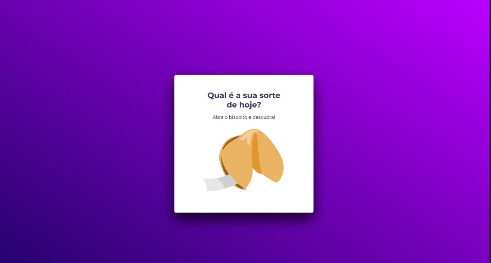

Neste Projeto você verá um jogo chamado Biscoito da Sorte, no qual o usuário, **a partir de um clique**, abre um biscoito com a sua sorte do dia. recursos utilizados:

- Estrutura de dados HTML
- Animações com CSS
- Funções no Javascript
- Manipulação da DOM
- Biblioteca JS Math()
- Funções *callback*
- Arrays

  [Aplicação homologada](https://cook-da-sorte.netlify.app/)

- 
